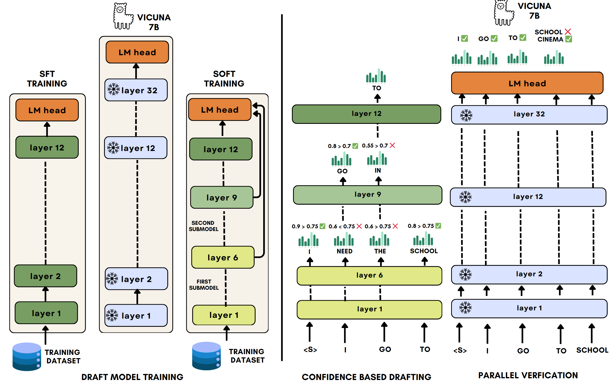

<div align="center">
   <h2>Sorted Draft Speculative Decoding (SD2): 
   Dynamic Speculative Decoding via Many-in-One Sorted Drafts</h2> 
 </div> 

<div align="center"> 
<a target="_blank" href="">
</a>
<a target="_blank" href="https://github.com/benyaminjami/Balcony-LLaMA">
</a>
<a target="_blank" href="https://huggingface.co/parsakaveh/SD2-SoFT-Draft">
</a>
<!-- <a target="_blank" href="https://twitter.com/DongfuJiang/status/1805438506137010326">
</a> -->
<br>
</div> 

## Introduction
Speculative Decoding (SD) is a popular method for accelerating inference in large language models (LLMs). It involves using a smaller draft model to generate multiple tokens, which are then verified in parallel by the target model, reducing decoding latency. While self-speculative decoding has seen success with dynamic target adaptation, the effect of making the draft model dynamic has not been fully explored. Most existing SD methods rely on rigid draft models, limiting scalability and flexibility.

In this paper, we introduce Sorted Draft Speculative Decoding (SD2), a many-in-one draft model that utilizes dynamic training and inference techniques. These include an adaptive draft selection mechanism and an adaptive attention tree, offering improved flexibility to meet diverse inference budget requirements. SD2 significantly enhances decoding speed without sacrificing generation quality.

Through extensive experiments with models of varying sizes (Vicuna 7B and 13B) on Spec-Bench datasets, we demonstrate that SD2 outperforms existing methods like Lookahead and REST, achieving speedups of 1.75× and 1.69× on the Vicuna 7B and 13B models, respectively.



<div align="center">
<font color="gray">Speedup comparison of Speculative Decoding methods on Spec-Bench.</font>
</div>

<!-- Sorted Speculative Decoding  (S2D) is a method providing the capability of selecting multiple draft models adaptively based on the given target. Without the need for training separate draft models for different target models, S2D enjoys the flexibility of having different submodels in the same architecture, which causes the approach outperforms other baselines in multi-target speculative decoding scenario. -->
<!-- Spec-Bench is a comprehensive benchmark designed for assessing Speculative Decoding methods across diverse scenarios. Based on Spec-Bench, we aim to establish and maintain a unified evaluation platform for open-source Speculative Decoding approaches. This platform facilitates the systematic assessment of existing methods ***in the same device and testing environment***, thereby ensuring fair comparisons.  -->

# Train

We use the [FastChat](https://github.com/lm-sys/FastChat/tree/main) codebase to train the draft models on the ShareGPT dataset.

## Installation

To set up the environment, first create and activate a new conda environment:
```
conda create -n sd2train python=3.9
conda activate sd2train
cd train
pip install -r requirements.txt
```

## Finetuning
1. Modify the `num_hidden_layers` attribute in the `config.json` of the Vicuna 7B pre-trained checkpoint to 12:

```vi {Vicuna7b_path}/config.json```

2. Train the draft model either with **SFT** or **SoFT**:
After changing the config to only pick the first 12 layers, you can run the training in either SFT or SoFT.
- For **SFT** model training:
```
cd train
sh scripts/train_draft_sft.sh
```
- For **SoFT** model training:
```
cd train
sh scripts/train_draft_soft.sh
```

<!-- ## Additonal Setup -->

<!-- #### REST (Optional) -->

<!-- ##### Build DraftRetriever from source -->

<!-- ```
cd model/rest/DraftRetriever
curl --proto '=https' --tlsv1.2 -sSf https://sh.rustup.rs | sh
maturin build --release --strip -i python3.9 # will produce a .whl file
pip3 install ./target/wheels/draftretriever-0.1.0-cp39-cp39-linux_x86_64.whl
``` -->
<!-- 
##### Create a datastore

```
cd model/rest/datastore
./datastore.sh # modify your own path
``` -->


# Evaluation

We used the [Spec-Bench](https://github.com/hemingkx/Spec-Bench/tree/main) code to evaluate our S2D approach and other baselines on multiple domains.

## Installation

To install dependencies for evaluation:

```
conda create -n sd2eval python=3.10
conda activate sd2eval
cd inference
pip install -r requirements.txt
```


Currently, Spec-Bench supports the evaluation of the following open source models:

- [EAGLE](https://sites.google.com/view/eagle-llm)
- [Hydra](https://github.com/zankner/hydra)
- [Medusa](https://sites.google.com/view/medusa-llm)
- [Speculative Sampling](https://huggingface.co/blog/assisted-generation)
- [Prompt Lookup Decoding](https://github.com/apoorvumang/prompt-lookup-decoding)
- [REST](https://sites.google.com/view/rest-llm/)
- [Lookahead Decoding](https://lmsys.org/blog/2023-11-21-lookahead-decoding/)

## Inference

To run inference, select the appropriate command in `eval.sh`. Results will be stored in `data/spec_bench/model_answer/`:

```
cd inference
./eval.sh
```

## Speedup Report

To compute the speedup compared to standard autoregressive decoding:

```
python evaluation/speed.py --file-path /your_own_path/s2d.jsonl --base-path /your_own_path/vicuna.jsonl
```

## Result Comparison

To compare the generated results with autoregressive decoding:

```
python evaluation/equal.py --file-path /your_own_path/model_answer/ --jsonfile1 vicuna.jsonl --jsonfile2 s2d.jsonl
```
<!-- 
## Contributing

We warmly welcome contributions and discussions related to Spec-Bench! If you have any suggestions for improvements or ideas you'd like to discuss, please don't hesitate to open an issue. This will allow us to collaborate and discuss your ideas in detail.

***More models are welcome!*** - If you're aware of any open-source Speculative Decoding methods not currently included in Spec-Bench, we encourage you to contribute by submitting a pull request. This helps ensure Spec-Bench remains a comprehensive and fair benchmarking platform for comparing existing methods. Please ensure that your changes are well-tested before submission. -->

## Acknowledgments

This codebase is built from [Spec-Bench](https://github.com/hemingkx/Spec-Bench/tree/main) and [FastChat](https://github.com/lm-sys/FastChat).

## Citation

If you find the resources in this repository useful, please cite our paper:

```
TODO
```

## Contact

For questions or issues, please open an issue on the GitHub repository or contact the authors directly.
